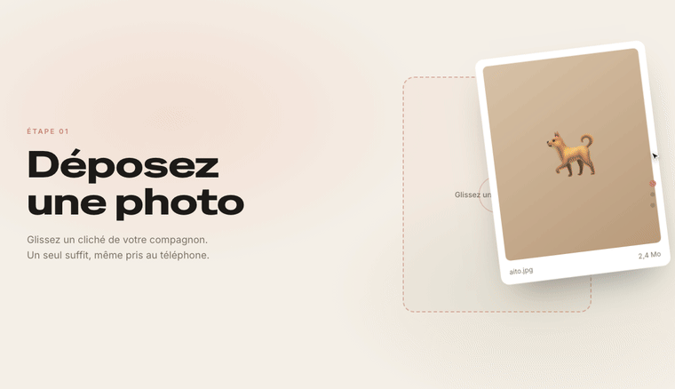
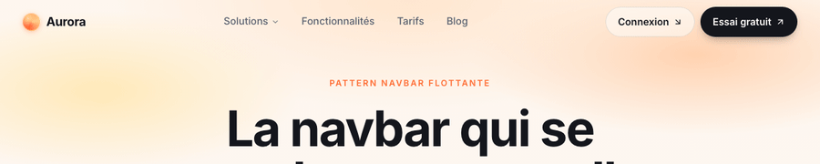
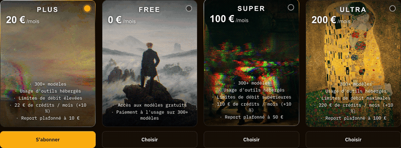

# Alt-Tab Components

Petite collection de composants web **autonomes et sans dépendance** : du HTML, du CSS et du JavaScript *vanilla*, rien d'autre. Chaque composant tient dans un seul dossier, se copie-colle tel quel et fonctionne en ouvrant simplement son `index.html`. Pensés pour être réutilisés sur les sites [Alt-Tab Studio](https://github.com/lgdlcs).

> Le fil rouge : des micro-interactions **pilotées par le geste** (scroll ou pointeur), fluides, accessibles, et qui dégradent proprement.

---

## 🧩 Composants

### 1 · Pinned scrollytelling



Une section **épinglée** (« pinned ») dont la *progression du scroll* anime une narration en trois scènes : on dépose une photo (drag & drop + analyse IA), on explore des variantes de style, puis le portrait est encadré et livré. Reproduction pédagogique du pattern vu sur [thelma.pet](https://thelma.pet/).

- **Le pattern** : un conteneur très haut (`height: 440vh`) crée la distance de scroll ; son enfant `position: sticky; height: 100vh` reste collé pendant toute la traversée. Des calques (texte + visuel) se croisent en fondu selon le pourcentage parcouru.
- **Anti-glitch** : *tout* est une fonction pure de la position de scène `pos` (0 → 2), recalculée à chaque frame. Aucune animation déclenchée « à l'entrée » donc rien ne se rejoue ni ne se superpose en revenant en arrière : c'est entièrement réversible et déterministe.
- **Détails** : curseur macOS qui glisse la carte, scanner « Analyse IA » qui pulse (pour signifier le chargement), sélection d'une variante par une onde de clic, cadre « drag & droppé » puis redressé. Respecte `prefers-reduced-motion`.

```bash
cd pinned-scrollytelling && python3 -m http.server 8000   # puis http://localhost:8000
```

### 2 · Floating pill navbar



Une barre de navigation pleine largeur qui se **rétracte en pilule flottante frostée** dès qu'on scrolle : largeur réduite, coins arrondis, fond *backdrop-blur*, ombre douce. On remonte en haut, elle se redéploie.

- **Le pattern** : un seuil de scroll (24 px) bascule un attribut `data-state="top" | "scrolled"`. Tout le morph est une **transition CSS** (`max-width`, `border-radius`, `backdrop-filter`, `box-shadow`…) sur cet attribut — le JS ne fait que poser le drapeau.
- **Léger** : écouteur de scroll *passif* + `requestAnimationFrame`, aucun recalcul de layout au scroll. Menu burger responsive inclus.

```bash
cd floating-pill-navbar && python3 -m http.server 8001   # puis http://localhost:8001
```

### 3 · Glitch plan cards



Des **cartes de tarifs** (Free / Plus / Super / Ultra) reprises du portail [Nous Research](https://portal.nousresearch.com/manage-subscription). Deux effets : une **bordure dégradée au survol**, et surtout l'image de la carte qui **se déchire quand on bouge la souris** (*datamosh* : déplacement par bandes + aberration chromatique), rendu par un **shader WebGL**.

- **Le shader** (WebGL *brut*, vertex + fragment repris à l'identique du bundle de Nous) : la texture est découpée en **12 bandes horizontales** ; chacune se décale selon la **vitesse du curseur** (uniform `vel`), avec séparation RVB (aberration chromatique) et scanlines. Plus on bouge vite, plus ça déchire ; à l'arrêt, l'image se recompose.
- **Le piège** : le handler souris **n'écrit jamais dans le DOM** — il pose `mx`/`my` dans un objet d'état, relu à chaque frame pour nourrir les uniforms (vitesse lissée, force par bande). Aucune mutation de style : l'effet est **invisible aux DevTools**, ce qui le rend déroutant à rétro-concevoir (il a fallu lire le bundle).
- **La bordure « arc »** (le survol) : un dégradé multi-bandes masqué en anneau de 1,4 px (`mask-composite: exclude`), **100 % CSS**.
- **Le fond** : un **tableau du domaine public** par formule (Friedrich · Turner · Rembrandt · Klimt), embarqué dans `img/`, peint comme texture du shader. Repli sur une texture générée localement si le réseau échoue.
- **Replis honnêtes** : pas de WebGL ou pas de GPU → l'image est peinte en **statique** (canvas 2D), exactement comme le `useGpuTier` de Nous. `prefers-reduced-motion` → image figée. `IntersectionObserver` + `visibilitychange` coupent le `rAF` hors écran.

```bash
cd glitch-plan-cards && python3 -m http.server 8002   # puis http://localhost:8002
```

---

## 🎯 Principes communs

- **Zéro dépendance** : pas de framework, pas de bundler, pas de librairie d'animation. On ouvre, ça marche.
- **Piloté par le geste** : écouteurs passifs (scroll, `pointermove`) + `requestAnimationFrame`, jamais de scroll-jacking (le scroll natif reste maître).
- **Accessible** : chaque composant neutralise ses animations sous `prefers-reduced-motion: reduce`.
- **Relisible** : le cœur logique de chaque composant tient dans un petit `script.js` commenté.

## 🚀 Lancer toute la galerie

```bash
python3 -m http.server 8770
# http://localhost:8770/pinned-scrollytelling/
# http://localhost:8770/floating-pill-navbar/
# http://localhost:8770/glitch-plan-cards/
```

---

## ✅ Règle : un GIF par composant

Chaque composant (un dossier avec un `index.html`) **doit** avoir un GIF de démo
`docs/<composant>.gif` référencé dans ce README. C'est vérifié automatiquement :

- **Localement** (hook pre-commit) : `git config core.hooksPath hooks` une fois, puis chaque `git commit` lance la vérif.
- **En CI** (`.github/workflows/check-gifs.yml`) : bloque la PR / le push si un GIF manque.
- **À la main** : `node scripts/check-component-gifs.mjs`.

La génération du GIF n'est pas automatisée (navigateur + interaction) : la recette est dans [`scripts/gen-gif.md`](scripts/gen-gif.md).

---

<sub>Pattern scrollytelling inspiré de <a href="https://thelma.pet/">thelma.pet</a>. Effet des cartes repris de <a href="https://portal.nousresearch.com/manage-subscription">Nous Research</a>. Construit par Alt-Tab Studio.</sub>
